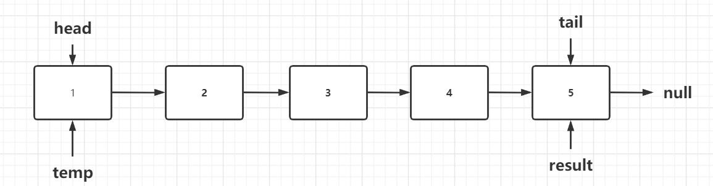
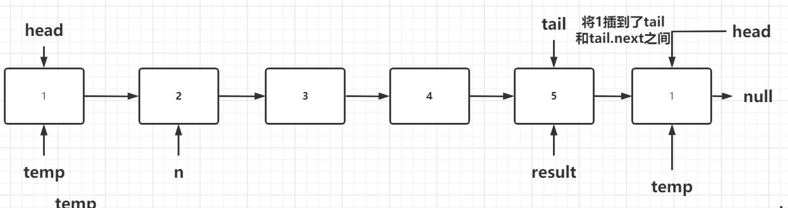
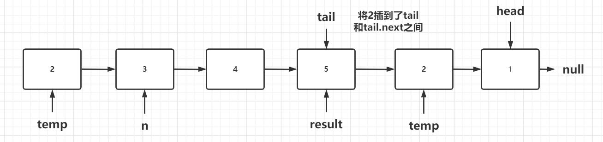
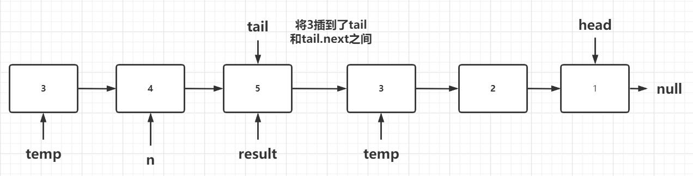
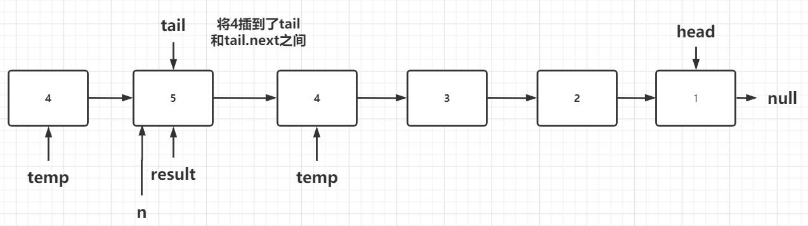
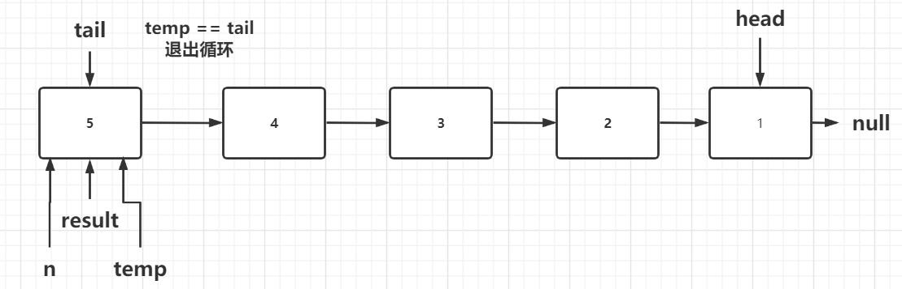

# 25. K 个一组翻转链表

> 题目链接：https://leetcode-cn.com/problems/reverse-nodes-in-k-group/

难度：困难

## 题目描述：

给你一个链表，每 *k* 个节点一组进行翻转，请你返回翻转后的链表。

*k* 是一个正整数，它的值小于或等于链表的长度。

如果节点总数不是 *k* 的整数倍，那么请将最后剩余的节点保持原有顺序。

 

**示例：**

给你这个链表：`1->2->3->4->5`

当 *k* = 2 时，应当返回: `2->1->4->3->5`

当 *k* = 3 时，应当返回: `3->2->1->4->5`

 

**说明：**

- 你的算法只能使用常数的额外空间。
- **你不能只是单纯的改变节点内部的值**，而是需要实际进行节点交换。


## 解题思路：

由题意可知，我们需要把链表按照K个结点一组进行分组，然后再给每组进行倒置，然后再连起来。

因此，问题就分为了，两个子问题：

（1）把链表按照K个结点一组分组，并记录头结点head和尾结点tail。

（2）根据子链表的head和tail结点，将子链表进行倒置，并且返回head和tail指针。


### 1、解决对任意长度链表的倒置：

#### 思路：

（1）特殊情况处理，若链表为null或者只有一个结点，我们直接把原链表返回。

（2）我们可以利用头插法的思想，对链表进行操作，这块的头插法是把尾部最后一个结点当成头的。

（3）我们利用一个指针temp起初指向head结点，用temp遍历整个子链表，若temp指向了tail结点，则退出循环

（4）我们通过temp每次从头部head拿到一个结点，把他插到尾部结点tail和tail.next的之间，这也就是我所说的头插法。


#### 图解：

（1）

（2）

（3）

（4）

（5）

（6）


#### 代码：

```java
public ListNode[] reversalList(ListNode head,ListNode tail) {
		ListNode[] result =  {head,tail};
		if(head == null || head == tail) {
			
			return result;
		}
		ListNode temp = head;
		while(temp!=tail) {
			ListNode t = tail.next;
			tail.next = temp;
			ListNode n = temp.next;
			temp.next = t;
			temp = n;
		}
		return result;
	}
```


### 2、K 个一组翻转链表

#### 思路：

我们可以使用两指针head和tail来记录子链表，利用tail指针遍历链表，先让head和tail都指向头结点，再使用一个计数器i来记录当前的结点在链表中的位置，当`i % k == 0`时，head和tail之间的链表就是截取的子链表，然后我们将它进行倒置，然后再连接到结果链表result上面，当遍历完整个链表，就拿到了最终结果。


代码：

```java
public ListNode reverseKGroup(ListNode head, int k) {
		ListNode result = new ListNode(0);
		ListNode re = result;
		ListNode tail = head;
		int i = 0;
		while( tail!= null) {		
			i++;
			if( i%k == 0) {
				ListNode tailNext = tail.next;
				ListNode[] temp = reversalList(head, tail);
				re.next = temp[1];
				re = temp[0];
				re.next = tailNext;
				head = tailNext;
				tail = re;
			}
			tail = tail.next;
		}
		return result.next;
    }
```


## 整体代码：

```java
/**
 * Definition for singly-linked list.
 * public class ListNode {
 *     int val;
 *     ListNode next;
 *     ListNode(int x) { val = x; }
 * }
 */
class Solution {
    	public ListNode reverseKGroup(ListNode head, int k) {
		ListNode result = new ListNode(0);
		ListNode re = result;
		ListNode tail = head;
		int i = 0;
		while( tail!= null) {		
			i++;
			if( i%k == 0) {
				ListNode tailNext = tail.next;
				ListNode[] temp = reversalList(head, tail);
				re.next = temp[1];
				re = temp[0];
				re.next = tailNext;
				head = tailNext;
				tail = re;
			}
			tail = tail.next;
		}
		return result.next;
    }
	
	public ListNode[] reversalList(ListNode head,ListNode tail) {
		ListNode[] result =  {head,tail};
		if(head == null || head == tail) {
			
			return result;
		}
		ListNode temp = head;
		while(temp!=tail) {
			ListNode t = tail.next;
			tail.next = temp;
			ListNode n = temp.next;
			temp.next = t;
			temp = n;
		}
		return result;
	}
}
```


### 测试代码：

```java
package com.company.project.hot100;

public class Question25 {
	public class ListNode {
		 int val;
		 ListNode next;
		 ListNode(int x) { val = x; }
	}
	
	
	public ListNode reverseKGroup(ListNode head, int k) {
		ListNode result = new ListNode(0);
		ListNode re = result;
		ListNode tail = head;
		int i = 0;
		while( tail!= null) {		
			i++;
			if( i%k == 0) {
				ListNode tailNext = tail.next;
				ListNode[] temp = reversalList(head, tail);
				re.next = temp[1];
				re = temp[0];
				re.next = tailNext;
				head = tailNext;
				tail = re;
			}
			tail = tail.next;
		}
		return result.next;
    }
	
	public ListNode[] reversalList(ListNode head,ListNode tail) {
		ListNode[] result =  {head,tail};
		if(head == null || head == tail) {
			
			return result;
		}
		ListNode temp = head;
		while(temp!=tail) {
			ListNode t = tail.next;
			tail.next = temp;
			ListNode n = temp.next;
			temp.next = t;
			temp = n;
		}
		return result;
	}
	
	public static void main(String[] args) {
		Question25 question25 = new Question25();
		ListNode a = question25.new ListNode(1);
		ListNode b = question25.new ListNode(2);
		ListNode c = question25.new ListNode(3);
		ListNode d = question25.new ListNode(4);
		ListNode e = question25.new ListNode(5);
		a.next = b;
		b.next = c;
		c.next = d;
		d.next = e;
		e.next = null;
		
		

		//测试翻转链表方法
//		ListNode[] result = question25.reversalList(a, e);
//		ListNode head = result[0];
//		ListNode tail = result[1];
//		ListNode r = question25.new ListNode(0);
//		r.next = tail;
//		do {
//			System.out.println(r.next.val);
//			r = r.next;
//		} while (r != head);
		
		ListNode result = question25.reverseKGroup(a, 3);
		
		while (result != null) {
			System.out.println(result.val);
			result = result.next;
		}		
	}
		
}

```


#### 复杂度分析：

时间复杂度：O(n)

空间复杂度：O(1)

