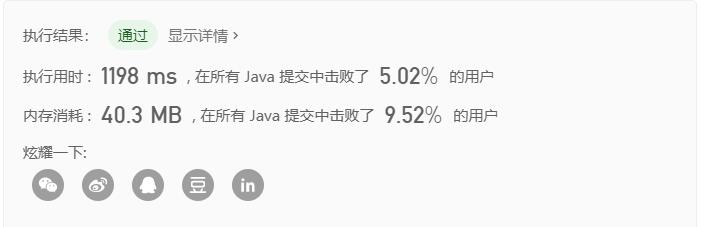
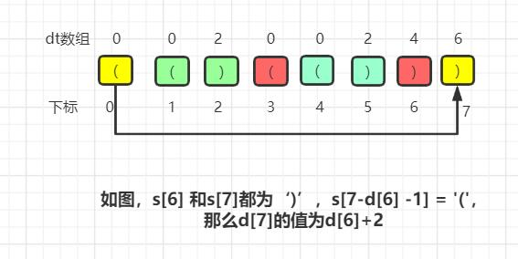
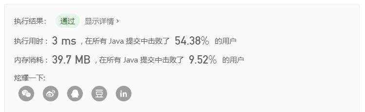

# 32. 最长有效括号

> 题目链接：https://leetcode-cn.com/problems/longest-valid-parentheses/

难度：困难

给定一个只包含 `'('` 和 `')'` 的字符串，找出最长的包含有效括号的子串的长度。

**示例 1:**

```
输入: "(()"
输出: 2
解释: 最长有效括号子串为 "()"
```

**示例 2:**

```
输入: ")()())"
输出: 4
解释: 最长有效括号子串为 "()()"
```


## 解法一：暴力法

根据题目意思，我们需要找到最长的包含有效括号的子串的长度，那么意味着，我们的最长子串不一定是原字符串的首元素开始的。

但是如果我们的最长子串都是从首元素开始的，那么这道题就会变得非常简单。我们只需要利用一个循环，挨个从0，1，……为首元素，开始截取字符串，然后在判断这个子串的最长有效长度，最后拿出最大值即可。

**如何判断计算一个字符串从首元素开始的最长有效长度？**

我们可以利用栈的思想，但是没必要使用栈数据结构，利用一个int变量temp（初始值为0）就可以代替：

（1）我们遍历字符串，若遇到 ' ( ' 就给temp++；若遇到 ' ) ' 就给temp--;

（2）若遇到 temp = 0,说明前面的字符串刚好满足条件，我们可以更新当前这次遍历的最大长度maxLen = i +1;

（3）若遇到 temp <  0,说明前面的字符串已经不满足条件了，就可以直接return maxLen。

**优化：**

我们既然要先遍历截取子串，那么' ) '开始的子串一定是不满足条件的，可以直接跳过。



该方法用时是非常高的，在死亡的边缘徘徊！！！


代码：

```java
public class Solution {
	public int longestValidParentheses(String s) {
		int result = 0;
		if(s.length()==0 && s.length()==1) {
			return 0;
		}
		for(int i = 0;i<s.length();i++) {
			if(s.charAt(i) == ')') {
				continue;
			}
			int maxLen = maxValid(s.substring(i));
			if(result < maxLen) {
				result = maxLen;
			}
		}	
		return result;
    }
	
	//计算从字符串串首开始计算最长有效的子串长度
	public int maxValid(String s) {
		int temp = 0;
		int maxLen = 0;
		for(int i = 0;i<s.length();i++) {
			if(s.charAt(i) == '(') {
				temp ++;
				
			}else {
				temp --;
				if(temp<0) {
					return maxLen;
				}
				if(temp == 0) {
					maxLen = i+1;
				}
			}
		}
		return maxLen;
	}
}
```

**复杂度分析**：

- 时间复杂度： O(n^2) 
- 空间复杂度：O(n)


## 解法二：动态规划法

这道问题可以使用动态规划法，问题要求的是`s[0,length-1]`的最长有效子串长度，我们可以用dt[length]数组来统计，dt[]数组的默认值为0，**dt[i]表示以i元素结尾的最长子串长度**，那么s[i]一定为 ')' 。

在统计过程中，会出现如下几种情况：

（1）当 `s[i]== ')' `，`s[i-1] =='('`时，例如："……()"，符合条件，我们只需要更新`dt[i] = dt[i-2] +2`，当然如果	`i-2<0`的话，直接赋值`dt[i]=2`；

（2）当`s[i] == ')'`，`s[i-1] == ')'`时，例如："……))"，如果`s[i-dt[i-1]-1] = '('`，

那么
$$
dt[i]=dt[i−1]+dt[i−dt[i−1]−2]+2
$$
解释：

如果最后一个元素为' ) '是有效子串的一部分，那么他一定有一个对应的' ( ' 在倒数第二个 ')' 所在的有效子字符串的前面，如图所示：




**代码：**

```java
public class Solution {
	public int longestValidParentheses(String s) {
		if(s.length()==0 || s.length()==1) {
			return 0;
		}
		int[] dt = new int[s.length()];
		int result = 0;
		for(int i = 1;i<s.length();i++) {
			if(s.charAt(i)==')') {
				if(s.charAt(i-1)=='(') {
					dt[i] = (i>=2?dt[i-2]:0) + 2;
				}else if(i>dt[i-1] && s.charAt(i-dt[i-1]-1)=='(' ){
					dt[i] = dt[i-1] + 2 + ((i-dt[i-1]-2)>=0?dt[i-dt[i-1]-2]:0);
				}
			}
			result = Math.max(result, dt[i]);
		}
		return result;
    }
}    
```

**复杂度分析：**

- 时间复杂度： O(n) 
- 空间复杂度： O(n)


## 解法三：栈操作

算法思路：

我们利用一个栈，里面先存入一个-1，方便后面计算有效子串长度，**我们栈中的栈首元素是为后面计算有效长度做标记**。

遍历字符串，

- 若遇到'('，就把下标入栈；
- 若遇到')'，就出栈；
  - 若栈为空，说明该子串无效，因为我们的栈首存放的是标记位，并非'('的下标，那么我们就把当前的i入栈，作为新子串的标记位；
  - 若栈不为空，说明该字串有效，那么更新最长子串长度result = Math.max(result, i-stack.peek());

该算法的巧妙之处，正是栈首存放的是标记位，而非记录'('的下标。



代码：

```java
public class Solution {
	public int longestValidParentheses(String s) {
		Stack<Integer> stack = new Stack<>();
		int result = 0;
		int len = 0;
		stack.add(-1);
		for(int i = 0;i<s.length();i++) {
			if(s.charAt(i)=='(') {
				stack.add(i);
			}else {
				stack.pop();
				if(stack.isEmpty()) {
					stack.push(i);
				}else {
					result = Math.max(result, i-stack.peek());
				}
			}
		}
		return result;
    }
}
```

**复杂度分析：**

- 时间复杂度： O(n) 
- 空间复杂度： O(n)